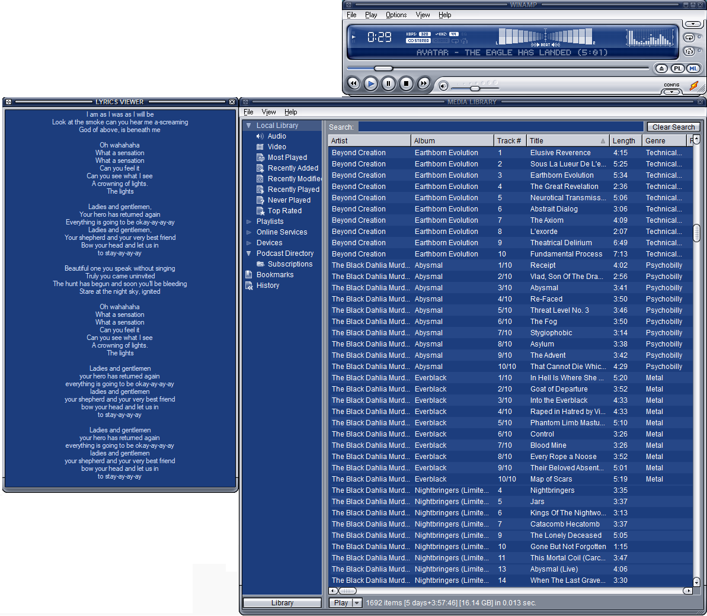

# Majest Lyrics — Winamp Plugin

A plugin for Winamp 5.53+ (tested on 5.8) that displays a resizable embedded window with lyrics fetched automatically from online sources. Compatible with Windows 10 and 11.

**Developer:** Majest

## Features

- Fetches lyrics automatically when a song starts playing
- Per-song cache — no duplicate requests within a session
- Refresh button forces a new request for the current song
- Resizable window embedded inside Winamp
- Follows Winamp's active color theme
- Optional mouse-wheel scrolling

## Lyric Sources

| Source | Type | Key required |
|--------|------|--------------|
| [LRCLib](https://lrclib.net) | Primary | No |
| [ChartLyrics](https://chartlyrics.com) | Fallback | Bundled |

LRCLib is tried first. ChartLyrics is used as fallback if LRCLib returns no result.

## Installation (pre-built)

1. Copy `WinampLyricsFinder/plugin-dlls/gen_lyrics.dll` into your Winamp `Plugins/` folder
2. Restart Winamp
3. The **Majest Lyrics** window will appear — enable it from the Winamp menu

## Building from source

### Requirements

- Visual Studio 2019 or later (v142 toolset, Win32 platform)
- Winamp SDK headers

### SDK setup

1. Obtain the Winamp SDK headers (publicly available with the Winamp open-source release)
2. Place the headers in the `sdk/` folder at the root of this repository — see `sdk/PUT_SDK_HERE.txt` for the expected folder structure

### Compile

Open `WinampLyricsFinder.sln` in Visual Studio, select **Release | Win32**, and build.

Copy the output `gen_lyrics.dll` from `WinampLyricsFinder/Release/` to your Winamp `Plugins/` folder.

> **Important:** Winamp is a 32-bit application — always build for **Win32**, never x64.

## Visuals

## License

Open source — free to use, modify, and distribute.
